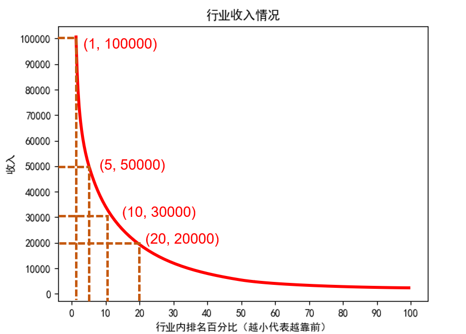
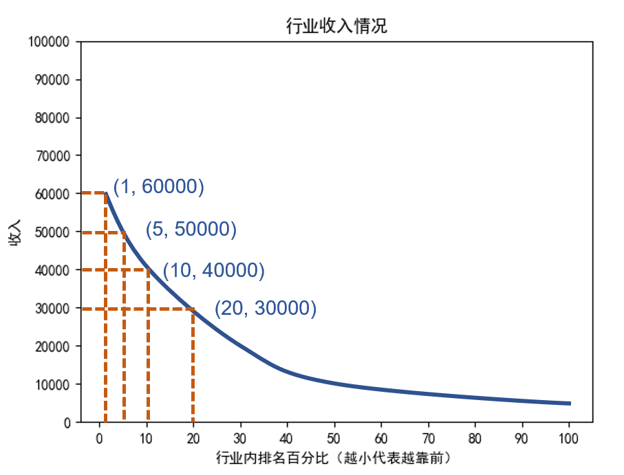
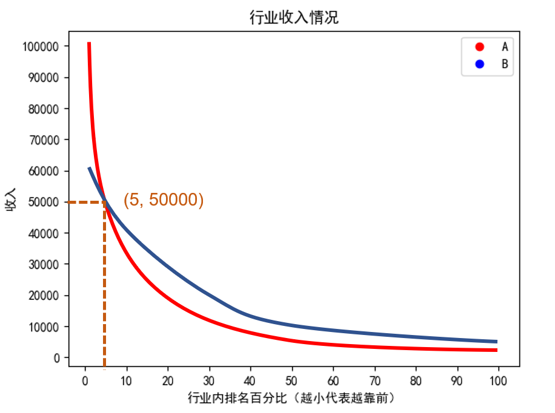
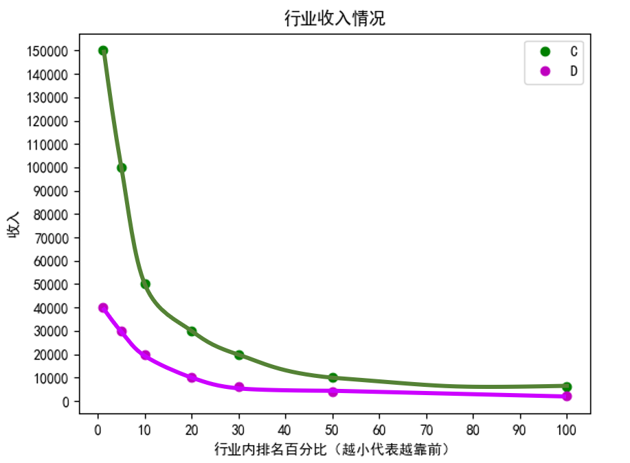

## 关于大学专业选择的思考

> 高考完了，关于大学专业的选择，相信不少朋友有很多困惑。
> 有的是自己高考完要选，有的是亲戚朋友要选想咨询。

### 1 专业的关注点概述

本期视频就来思考一下这个问题。
这个视频并不会告诉你一个具体的答案：
哪个专业好，应该选择哪个专业。

本视频主要是展示一种思考与比较的方法，供大家参考借鉴。

而且这个方法并不只是高考完填报志愿有意义，
对那些选了专业上了大学的朋友也有同等重要的意义。

关于专业，
大部分家长或者学生关注点往往是：
1. 就业、收入。
2. 感兴趣。
3. 有天赋、擅长。

**其实我个人觉得，还有一个很有意义的关注点是：**
4. 这个专业的劳累、轻松程度。

因为有的专业相比其他专业很累，很辛苦，但是就业和收入却并不比比其他专业高。

当然，刚上完高中的朋友，可能会有线性思维，
觉得越苦越累越充实，越能学知识，越能涨本事。

我只能说，大学和高中最大的不同就是，
高中是线性的，大学是多元的。
具体的表现是，苦了累了也未必有收获，
当然这并不是说，大家就不该吃苦。
而是，有的事很苦累有收益，有的事很苦累却没收益。
所以，要去比较，要去选择那些
$$收益苦累比=\frac{收益}{苦累}$$
大的事情。
这就是为什么网上很多人说，选择很重要。

那么哪些方向的收益苦累比大，
哪些方向的收益苦累比小呢，
这是需要花时间探索的。

有自己的时间，才能去探索对自己而言收益苦累比较小的方向，也就是去探索契合自己的人生方向和兴趣爱好，才能找到属于自己的道。
对于大学生而言，我觉得这是最重要的事情。

如果一个专业，有繁重的课程、作业、任务、考试，占满了学生的时间，
学生还哪里有时间去摸索与思考自己的人生方向呢？

这个话题4，以后有机会再具体展开。

**本期视频主要还是围绕1来展开**
并不是说2、3不重要，其实2、3同等重要。

但是大多数高考考生，其实没有条件去深入了解一个专业，并没有了解大学这个专业具体要学什么，要做什么。
这种情况下的喜欢可能是肤浅的，
这种情况下的擅长可能只是一厢情愿的幻想。

所以虽然2，3很重要，但是大多数高中生把握不住。
反而上了大学之后好把握。
喜欢也好，擅长也罢，都是比较的结果。
而只有亲身体验过了，才能有自己的感受，做出最有意义的比较与选择。
理论上最好的办法，是挑两个专业都学一段时间，比较之后选择更喜欢更擅长的。

但是这并不现实，所以只能推荐：
多和不同专业的人交流，
尝试了解不同专业的情况，
甚至选修对应的课程，去深入了解与体验不同专业，然后做出选择与比较。

后面的思考中，将行业和专业按照同一个东西来理解分析。
（为了简单，实际情况可能会更复杂，因为有的学科，专业和行业区别很大）

### 老生常谈的一句话
关于就业、收入，老生常谈的一句话就是：
什么专业，只要学到顶尖，都能赚大钱。

有些人很反感这句话，有些人很认可这句话，
不同的人有不同的看法。

对于这句话，其实有两种理解方式
1. 在自己的专业，不断努力，做到顶尖。
2. 去寻找适合自己，自己能学到顶尖的专业。

大部分的理解方式都是第一种；
很多批判这句话的人，
往往是在批判第一种理解方式，
而他们是支持第二种理解方式的。

我个人更倾向第二种，但并不完全认同第二种。
这里详细说下我对这句话的理解。
首先，我不认同第一种理解方式的原因在于：

### 一个行业的顶尖不是单纯努力能达不到
人的努力是由两层极限限制的。
- 首先，人的努力程度是有极限的，一天24小时，哪怕是超人不吃不喝，撑死能努力24小时。
- 其次，努力之后得到的回报，也是有极限的。

因为这两层极限的存在，大多数人很难在自己所在的行业做到顶尖。
不认同这个观点的朋友不妨思考下，你通过努力成为高考状元了吗？
或者退而求其次，你通过努力成为高考前十名了吗？

个人认为，更可能的情况是：
大多数人通过一定的努力在行业里可能处于前20%-50%，
特别努力或者有天赋能做到前10%-20%，
再有点运气和机缘能做到前5%-10%。

基于这样的判断，关注行业顶尖（前1%）的收入没有太大意义，
关注自己未来处于的区间才有实际意义。

举个例子具体说明下，A行业的收入图如下

- $F_A(1)=100000$：前1%的人收入是10万
- $F_A(5)=50000$：前5%的人收入是5万
- $F_A(10)=30000$：前10%的人收入是3万
- $F_A(20)=20000$：前20%的人收入是2万

> 这里A行业前x%的人收入，
> 准确来讲是指A行业第x%的人收入，
> 记为$F_A(x)$。
> （本文为了方便，将第x%的人收入称为前x%的人收入，后文同理）

B行业的收入图如下

- $F_B(1)=60000$：前1%的人收入是6万
- $F_B(5)=50000$：前5%的人收入是5万
- $F_B(10)=40000$：前10%的人收入是4万
- $F_B(20)=30000$：前20%的人收入是3万

如果把AB行业对比一下，

那么如果是行业5%之前的，A行业更好。
如果是行业5%之后的，B行业更好。

所以说，行业顶尖的收入其实没有太大关注的意义。
同理，行业的平均收入意义也不是特别大，
因为低收入很容易被顶尖收入平均。

收入分布图更有意义，或者更进一步，
你所处的区间以及你未来能达到的区间的收入才有意义，
不过大多数时候这个数据很难得到。

### 就算是顶尖，不同行业的顶尖也有区别
我刚才举得例子还是比较温和的，AB行业差距不是太大。
而现实情况可能比这更多元更复杂。
很有可能行业间的差距非常大，
举个例子示意下：
C、D行业的收入图如下

C行业
- $F_C(1)=150000$：前1%的人收入是15万
- $F_C(5)=100000$：前5%的人收入是10万
- $F_C(10)=50000$：前10%的人收入是5万
- $F_C(20)=30000$：前20%的人收入是3万

D行业
- $F_D(1)=40000$：前1%的人收入是4万
- $F_D(5)=30000$：前5%的人收入是3万
- $F_D(10)=20000$：前10%的人收入是2万
- $F_D(20)=10000$：前20%的人收入是1万

同样是前百分之一，C行业的收入是D行业的三倍还要多。
不仅如此，C行业前10%的收入比D行业前5%的收入要高很多，
从这个角度来讲，如果一个D行业前5%的人转行到C行业，排名降到C行业前10%，
他的收入其实也是增加了的。

这个例子还是不够极端，现实中可能会有，
一个行业E前5%的收入不如另一个行业F前25%的，
假如这两个行业做到相同排名的付出是相同，
再假设这两个行业做到前25%的付出是1，排名往前5%，付出翻一倍，
那么做到
前20%的付出是2，
前15%的付出是4，
前10%的付出是8，
前5%的付出是16，
在E行业可能要付出16倍的努力，才能和F行业付出1份努力的收入一样。
如果在E行业付出只有8倍，收入还比不上在F行业付出1份努力的，
这也就是为什么很多人觉得选择大于努力。

这里的例子还是建立一个人在不同行业，
付出相同的努力，能得到相同的排名的假设下的。

### 一个人和不同行业的契合度是不同的
举例说明，一个人付出一份努力
可能在A行业能做到前10%
在B行业能做到前20%，
在C行业能做到前30%。
那么他和A行业的契合度>B行业的契合度>C行业的契合度。
通俗一点的讲，契合度也可以理解为合适程度。

一个人和某个行业的契合度，可能和先天的天赋与后天的学习方法有关，
这个以后有机会再详细讨论。

回到契合度，一个人应该选择和自己契合度最高的行业吗？
由于行业的收入差异，自己契合度最高的行业未必是自己收入最高的行业。

举个例子，假定一个人付出一份努力，
能做到一个行业的前50%，契合度为1，
能做到一个行业的前45%，契合度为2，
能做到一个行业的前40%，契合度为3，
契合度+1或者多付出一倍的努力，能往前进5%。

假设主人公张三，和A、B、C、D、E五个行业的契合度分别为
1，2，3，4，5

那么他付出$u = 2^n$份努力，则ABCDE的排名分别为：
50% - 5n%， 45% - 5n%， 40% - 5n%， 35% - 5n%， 30% - 5n%
而此时对应的收入分别为
Sa, Sb, Sc, Sd, Se
那么对于他而言，最优的选择是收入最高的那个，
而并不一定是契合度最高的那个。

那么使用以上的猜想，
可以简出一个数学公式为
$$ S = F_h(50 - log_2 u - Q_h) $$
- S: 代表收入
- $F_h$: 行业排名收入函数，
输入值代表百分比排名，值为对应收入
比如$F_h$(1)=100000，代表行业前1%收入为100000
$F_h$(5)=50000，代表行业前5%收入为50000
- u: 付出的努力（份数）
- $Q_h$: 契合度

基于这个数学公式，
想要得到更好的收入，
通过不断地努力，增加u值得到的收效是有限的
重要的是改善$F_h$和$Q_h$，即要挑选合适的行业。

### 总结
当然这个数学公式只是建立在一系列个人的猜想上的，
现实的情况未必如此，会比这更加复杂，
而且会有很多其他影响因子。

但我并不认为上面的分析没有意义，
上面的分析，主要是给大家展示一种大胆假设+理性思考的过程，
提供一种可以借鉴的分析方法。

信息爆炸的时代，
面对网上各种纷乱复杂的劝退、劝进言论，
那些懵懂的朋友们该如何去避免去想当然或者人云亦云？
答案是一定要有自己的理性思考与冷静判断。

这里只是演示了我是怎么思考这个问题的，
希望能供大家借鉴，给大家一点启发。

我只强调一点：
不要相信我的观点，请思考我的思考。

当然，有的观众可能并不满意这样的思考，
因为并没有一个明确的结果，并没有告诉他说你应该选择哪个专业。

甚至有的观众可能希望说：
别给我整那些乱七八糟、故弄玄虚的思考过程，
能不能直接告诉我哪个专业好，我选哪个。

这里我只能说 ，我没办法给你一个具体的答案。

我只能说：
上面公式中，行业的排名收入勉强可以从现有的各种收入数据观察预估 + 实践考察。
而行业和个人的契合度，只有亲身体验过，亲自尝试过，才能有一个大体的感觉。

目前来讲，别人无法帮自己实现这个。

那么最后又回到我开头说的，
人一定要有自己的时间，
去尝试，去摸索，去观察，去思考，
去寻找适合自己的职业发展方向，去探索契合自己的人生方向和兴趣爱好，才能找到属于自己的道。

所以我特别喜欢马克思的一句话：时间是人发展的空间。

> 原句是：时间实际上是人的积极存在，它不仅是人的生命的尺度，而且是人的发展的空间。
> 出自马恩全集 第47卷 p532
> [马克思恩格斯全集（文字版PDF）](https://www.marxists.org/chinese/marx-engels/index.htm)
> pdf第542页为原文p532

那么有人可能会问，
怎么尝试？怎么摸索？
怎么观察？怎么思考啊？

这些问题说来话长，未来有机会再详细展开说吧
毕竟本期内容已经很长啦。
