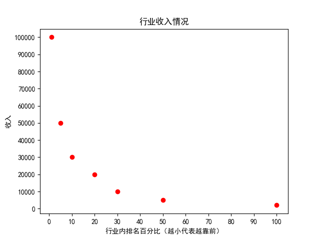
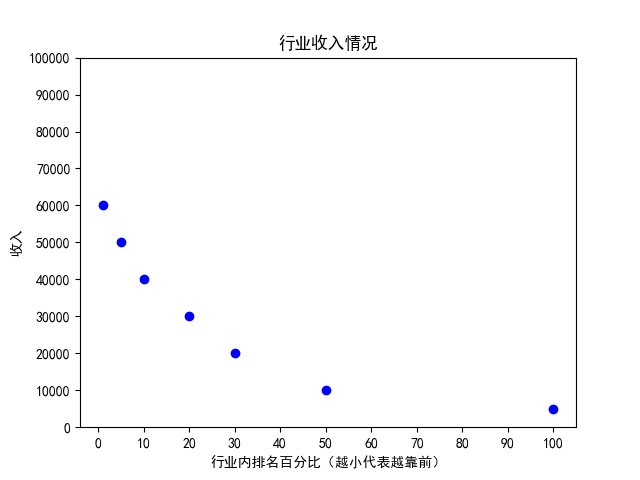

## 关于大学专业选择的思考

> 高考完了，关于大学专业的选择，相信不少朋友有很多困惑。
> 有的是自己高考完要选，有的是亲戚朋友要选想咨询。

### 1 专业的关注点概述

本期视频就来思考一下这个问题。
这个视频并不会告诉你一个具体的答案：
哪个专业好，应该选择哪个专业。

本视频主要是展示一种思考与比较的方法，供大家参考借鉴。

而且这个方法并不只是高考完填报志愿有意义，
对那些选了专业上了大学的朋友也有同等重要的意义。

关于专业，
大部分家长或者学生关注点往往是：
1. 就业、收入。
2. 感兴趣。
3. 有天赋、擅长。

**其实我个人觉得，还有一个很有意义的关注点是：**
4. 这个专业的劳累、轻松程度。

因为有的专业相比其他专业很累，很辛苦，但是就业和收入却并不比比其他专业高。

当然，刚上完高中的朋友，可能会有线性思维，
觉得越苦越累越充实，越能学知识，越能涨本事。

我只能说，大学和高中最大的不同就是，
高中是线性的，大学是多元的。
具体的表现是，苦了累了也未必有收获，
当然这并不是说，大家就不该吃苦。
而是，有的事很苦累有收益，有的事很苦累却没收益。
所以，要去比较，要去选择那些
$$收益苦累比=\frac{收益}{苦累}$$
大的事情。
这就是为什么网上很多人说，选择很重要。

那么哪些方向的收益苦累比大，
哪些方向的收益苦累比小呢，
这是需要花时间探索的。

有自己的时间，才能去探索对自己而言收益苦累比较小的方向，也就是去探索契合自己的人生方向和兴趣爱好，才能找到属于自己的道。
对于大学生而言，我觉得这是最重要的事情。

如果一个专业，有繁重的课程、作业、任务、考试，占满了学生的时间，
学生还哪里有时间去摸索与思考自己的人生方向呢？

这个话题4，以后有机会再具体展开。

**本期视频主要还是围绕1来展开**
并不是说2、3不重要，其实2、3同等重要。

但是大多数高考考生，其实没有条件去深入了解一个专业，并没有了解大学这个专业具体要学什么，要做什么。
这种情况下的喜欢可能是肤浅的，
这种情况下的擅长可能只是一厢情愿的幻想。

所以虽然2，3很重要，但是大多数高中生把握不住。
反而上了大学之后好把握。
喜欢也好，擅长也罢，都是比较的结果。
而只有亲身体验过了，才能有自己的感受，做出最有意义的比较与选择。
理论上最好的办法，是挑两个专业都学一段时间，比较之后选择更喜欢更擅长的。

但是这并不现实，所以只能推荐：
多和不同专业的人交流，
尝试了解不同专业的情况，
甚至选修对应的课程，去深入了解与体验不同专业，然后做出选择与比较。

### 2 关于就业、收入
老生常谈的一句话就是：
什么专业，只要学到顶尖，都能赚大钱。

有些人很反感这句话，有些人很认可这句话，
不同的人有不同的看法。

对于这句话，其实有两种理解方式
1. 在自己的专业，不断努力，做到顶尖。
2. 去寻找适合自己，自己能学到顶尖的专业。

大部分的理解方式都是第一种；
很多批判这句话的人，
往往是在批判第一种理解方式，
而他们是支持第二种理解方式的。

我个人更倾向第二种，但并不完全认同第二种。
这里详细说下我对这句话的理解。
首先，我不认同第一种理解方式的原因在于：
**一个行业的顶尖不是单纯努力能达不到**
人的努力是由两层极限限制的。
- 首先，人的努力程度是有极限的，一天24小时，哪怕是超人不吃不喝，撑死能努力24小时。
- 其次，努力之后得到的回报，也是有极限的。

因为这两层极限的存在，大多数人很难在自己所在的行业做到顶尖。
不认同这个观点的朋友不妨思考下，你通过努力成为高考状元了吗？
或者退而求其次，你通过努力成为高考前十名了吗？

个人认为，更可能的情况是：
大多数人通过一定的努力在行业里可能处于前20%-50%，
特别努力或者有天赋能做到前10%-20%，
再有点运气和机缘能做到前5%-10%。

基于这样的判断，关注行业顶尖（前1%）的收入没有太大意义，
关注自己未来处于的区间才有实际意义。

举个例子具体说明下，A行业的收入图如下

前1%的人收入是10万
前5%的人收入是5万
前10%的人收入是3万
前20%的人收入是2万

B行业的收入图如下

前1%的人收入是6万
前5%的人收入是5万
前10%的人收入是4万
前20%的人收入是3万

如果把AB行业对比一下，
那么如果是行业5%之前的，A行业更好。
如果是行业5%之后的，B行业更好。

所以说，行业顶尖的收入其实没有太大关注的意义。
同理，行业的平均收入意义也不是特别大，
因为低收入很容易被顶尖收入平均。

收入分布图更有意义，或者更进一步，
你所处的区间以及你未来能达到的区间的收入才有意义，
不过大多数时候这个数据很难得到。

**就算是顶尖，不同行业的顶尖也有区别**
我刚才举得例子还是比较温和的，AB行业差距不是太大。
而现实情况可能比这更多元更复杂。
很有可能行业间的差距非常大，
举个例子示意下：
